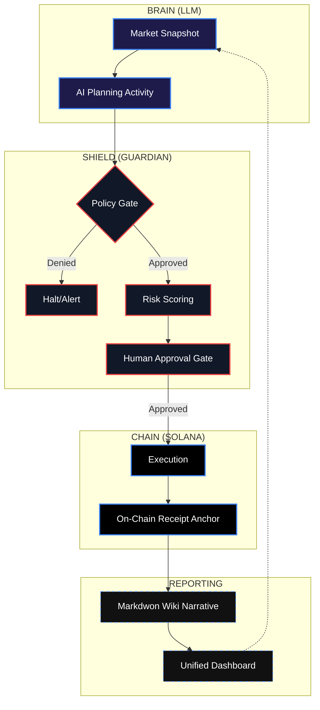

# 🛡️ Guardian

**Guardian** is a "self-driving wallet" for Solana that is policy-bound, cryptographically auditable, and autonomously protective. It continuously monitors your portfolio, evaluates risks (drawdowns, rug-pulls, fees), and executes protective plans under a strict deterministic safety engine.

---

## 🚀 Core Pillars

- **🛡️ Policy-Bound**: Every action is gated by a deterministic TypeScript engine. No LLM "hallucinations" can bypass your spent limits or risk thresholds.
- **🔍 Cryptographically Auditable**: Every execution generates a SHA-256 JSON receipt, anchored on-chain via SPL Memo transactions.
- **🖥️ Unified Command Center**: A high-fidelity Next.js dashboard for real-time governance, Wiki browsing, and SigNoz observability.
- **📖 Living Wiki**: All agent runs, receipts, and incidents are rendered into a human-readable Markdown Wiki for transparent oversight.
- **🤖 Autonomous (Daemon)**: An always-on loop with intelligent exponential backoffs, operational state tracking, and incident halting logic.

---

## 🛠️ Architecture: The Guardian Pipeline

Every cycle follows a non-negotiable safety pipeline:



---

## ⚡ Quick Start

### 1. Installation
```bash
git clone https://github.com/knarayanareddy/Guardian.git
cd guardian
npm install
```

### 2. Configuration
Copy the `.env.example` to `.env` and fill in your keys:
```bash
cp .env.example .env
```
Key variables:
- `OPENAI_API_KEY`: For the planning intelligence.
- `SOLANA_RPC_URL`: Devnet recommended.
- `AGENT_KEYPAIR_PATH`: Path to your Solana JSON keypair.
- `APPROVAL_MODE`: `always` | `policyOnly` | `never`.

This creates the necessary `data/` and `wiki/` directories.

---

## 🖥️ Unified Command Center

The Guardian Dashboard is a high-fidelity Next.js application that provides a single pane of glass for your swarm.

### 1. Launch the Dashboard
```bash
cd dashboard
npm install
npm run dev -- -p 3001
```
Access at `http://localhost:3001`.

### 2. Showcase Mode (Simulator)
No SOL? No problem. Use the seeder to populate the dashboard with realistic demonstration data:
```bash
# Enable Showcase Mode in .env
echo "GUARDIAN_SHOWCASE_MODE=true" >> .env

# Run the seeder
npx ts-node scripts/seed-showcase.ts
```

---

## 🎮 CLI Reference

### `guardian wallet`
Displays your current SOL balance and portfolio value.
```bash
npx ts-node src/index.ts wallet
```

### `guardian run [--dry-run]`
Performs a single execution cycle. Use `--dry-run` to simulate without touching the chain.
```bash
npx ts-node src/index.ts run --dry-run
```

### `guardian daemon [--interval <secs>]`
Starts the autonomous always-on mode. Tracks consecutive failures and automatically halts if external factors (RPC dropout, API quota) make the agent unstable.
```bash
npx ts-node src/index.ts daemon --interval 60
```

### `guardian verify --receipt <hash>`
Cryptographically verifies a local receipt against the on-chain anchor and the signature record.
```bash
npx ts-node src/index.ts verify --receipt 1234abcd...
```

### `guardian receipt list`
Shows all historical execution receipts and their status.

---

## 🛡️ Safety & Security

1. **Devnet by Default**: The system is hard-coded to warn/gate against mainnet usage unless explicitly overridden in every environment variable.
2. **Deterministic Gating**: Even with the best LLM, common agent failure modes (uncontrolled spending) are prevented by the hard-coded `policy.engine.ts`.
3. **No Private Key Retention**: Private keys are never logged, sent to the LLM, or stored in receipts.
4. **Failure Backoffs**: The daemon detects `429` Rate Limits and backs off exponentially to prevent RPC bans.

---

## 📂 Audit Log (Wiki)
Check the `wiki/` folder for a historical record of everything the agent has done:
- `wiki/runs/`: Run rollup indices.
- `wiki/receipts/`: Human-readable receipt summaries.
- `wiki/incidents/`: Post-mortem reports for daemon halts.

---
*Built with ❤️ for a safer autonomous Solana.*
